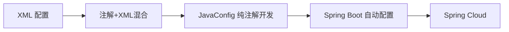

# Spring开发方式演变

## 🧩 最初：基于 XML 的配置方式（Spring 1.x - 2.x）

### 📌 背景

- 最初的 Spring 核心理念是“控制反转”（IoC）和“面向接口编程”，引入 BeanFactory/ApplicationContext。
- Java 当时缺少注解机制，配置方式只能依赖 XML。

### ⚙️ 特征

- 所有 Bean 定义、依赖注入、AOP 配置、事务声明都集中在 XML 文件中。
- 每个类几乎都需要在 XML 中声明。

### 📄 示例

```xml
<bean id="userService" class="com.example.UserService">
    <property name="userRepository" ref="userRepository"/>
</bean>

<bean id="userRepository" class="com.example.UserRepository"/>
```

### ✅ 优点

- 配置集中，便于统一管理。
- 解耦合、利于替换实现类。

### ❌ 缺点

- 配置繁琐、文件庞大、易出错。
- 缺乏类型检查，重构成本高。
- 阅读难度大，不利于团队协作。

### 🎯 适用场景

- 早期传统项目（已被淘汰）

------

## 🧩 过渡：注解+xml混合的开发方式（Spring 2.5 - 3.x）

### 📌 背景

- Java 5 开始支持注解。
- 为提升开发效率，Spring 引入 `@Component`、`@Autowired` 等注解。

### ⚙️ 特征

- Java 类本身使用注解进行组件声明。
- 自动注入依赖，减少 XML。

### 📄 示例

```java
@Component
public class UserService {
    @Autowired
    private UserRepository userRepository;
}
<context:component-scan base-package="com.example"/>
```

### ✅ 优点

- 简化配置，开发效率大幅提升。
- 依赖注入更直观。

### ❌ 缺点

- 配置分散在类中，难以统一查找。
- 框架控制增强，逻辑更“黑盒”。
- XML 和注解共存，维护复杂。

### 🎯 适用场景

- 中小型项目、老项目升级过渡期。

------

## 🧩 现代：纯注解开发-基于 Java Config 的开发方式（Spring 3.x - 4.x）

### 📌 背景

- Spring 进一步拥抱纯 Java 的配置风格。
- 引入 `@Configuration` 和 `@Bean`，完全抛弃 XML 成为可能。

### ⚙️ 特征

- 用 Java 类作为配置文件，IDE 支持良好，类型安全。

### 📄 示例

```java
@Configuration
public class AppConfig {
    @Bean
    public UserService userService() {
        return new UserService(userRepository());
    }

    @Bean
    public UserRepository userRepository() {
        return new UserRepository();
    }
}
```

### ✅ 优点

- 可维护性强，支持 IDE 自动补全。
- 配置可复用，可组合（Import）。

### ❌ 缺点

- 相比注解或 Boot，仍需手动声明。
- 对初学者不够直观。

### 🎯 适用场景

- 强调配置逻辑可视化、可组合性需求的项目。

------

## 🧩 SpringBoot时代：Spring Boot 模式（Spring 4.x - 5.x）

### 📌 背景

- 社区期望更快构建项目、更少配置。
- Spring Boot 提供一站式自动配置 + 依赖管理 + 内嵌容器。

### ⚙️ 特征

- 零 XML、零 `@Configuration`、零 `web.xml`
- 引导类 + 注解启动整个项目。
- 整合常用组件（MyBatis, Redis, RabbitMQ 等）自动配置。

### 📄 示例

```java
@SpringBootApplication
public class DemoApp {
    public static void main(String[] args) {
        SpringApplication.run(DemoApp.class, args);
    }
}
```

### ✅ 优点

- 零配置起步快。
- 自动装配、starter 模块减少重复工作。
- 内嵌服务器支持 jar 包部署。
- 社区生态丰富，Spring Initializr 快速生成项目。

### ❌ 缺点

- 自动装配黑盒感强。
- 启动慢于传统 Spring 项目（但可优化）。
- 对调试和排错要求更高。

### 🎯 适用场景

- 快速开发应用、中小型服务、Spring Cloud 微服务底座。

# 🧩 微服务时代：Spring Cloud 微服务体系（Spring 5.x - 至今）

### 📌 背景

- 微服务兴起，单体系统向服务化演进。
- Spring Cloud 提供微服务组件整合套件，统一标准和整合 Netflix、Alibaba 开源生态。

### ⚙️ 特征

- 构建在 Spring Boot 之上。
- 提供服务注册、配置中心、服务网关、熔断、负载均衡等基础设施。

### 📄 组件列表

| 模块                         | 作用               |
| ---------------------------- | ------------------ |
| Spring Cloud Eureka/Nacos    | 服务注册与发现     |
| Spring Cloud Gateway         | API 网关           |
| Spring Cloud Config          | 分布式配置中心     |
| Spring Cloud OpenFeign       | 声明式 HTTP 客户端 |
| Spring Cloud Sleuth + Zipkin | 链路追踪           |

### ✅ 优点

- 解决分布式架构中的复杂性。
- 高度集成、快速搭建微服务平台。
- 支持 Docker/K8s 云原生部署。

### ❌ 缺点

- 学习成本高，系统复杂。
- 自动装配带来调试困难。

### 🎯 适用场景

- 分布式系统、大型互联网平台、云原生应用。

# ✅ 总结




| 阶段              | 开发方式                            | 是否推荐     | 使用方式                 | 典型项目             |
| ----------------- | ----------------------------------- | ------------ | ------------------------ | -------------------- |
| XML 配置          | `*.xml`                             | ❌ 淘汰       | 全 XML 配置              | 早期遗留项目         |
| 注解+XML配置      | `@Component` + XML                  | ❌ 淘汰       | 注解 + 扫描 + 配置文件   | 桥接式维护           |
| Java Config纯注解 | `@Configuration` + `@Bean`          | ✅ 推荐       | 纯 Java 配置             | 中型项目             |
| Spring Boot       | `@SpringBootApplication` + 自动配置 | ✅✅ 主流      | 无配置启动、starter 模块 | 中小项目             |
| Spring Cloud      | Spring Boot + 微服务组件            | ✅✅✅ 强烈推荐 | 分布式组件化开发         | 大型系统、企业级平台 |